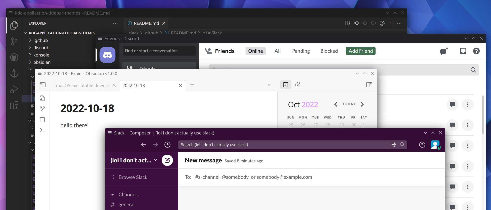

# kde-application-titlebar-themes

A set of application-specific KDE titlebar themes that match the titlebar's colors to the rest of the application's UI without giving up the full native titlebar.

## Installing and Using

Titlebar themes are provided as `.colors` files which can be downloaded and placed in `~/.local/share/color-schemes`.

To apply a color scheme to a window, first create a window rule in one of two ways:

- Right-click the native titlebar, menu to "More Actions", then "Configure Special Application Settings..." - this will create or edit a window rule for the current application.
- System Settings > Window Management > Window Rules - this will show you all your window rules and allow you to create a new one (though to match the application you'll need to know its window class)

Once you have a rule for the application, add the property "Titlebar color scheme", set the first dropdown to "Force", and select the color scheme you want in the second dropdown.

KDE window rules can also be used to force the native titlebar to show up on frameless windows, but they cannot hide non-native titlebars displayed by individual applications. Some applications may require you to change settings or perform other tweaks to hide their custom titlebars and use the native one.
