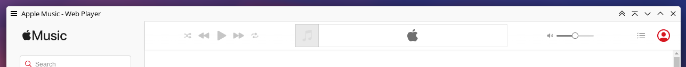

# Apple Music

Apple Music doesn't have a desktop app on Linux, but you can use it as a web app
via [Mint's webapp manager](https://github.com/linuxmint/webapp-manager) or
another similar tool.

For best results with this color scheme, I install a userstyle manager like
[Stylus](https://add0n.com/stylus.html) in the Apple Music webapp's Chromium
profile and use the following style to add a border above the player bar and
make the navigation menu a consistent background when the window is narrow:

```css
@-moz-document domain("music.apple.com") {
	.player-bar {border-top: 1px solid #D3D3D3}
	.navigation {--mobileNavigationBG: #F9F9F9}
}
```

The screenshot below has this custom CSS applied.

## `Apple Music.colors`


