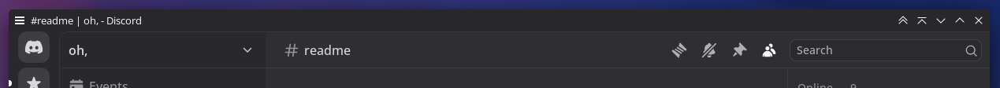
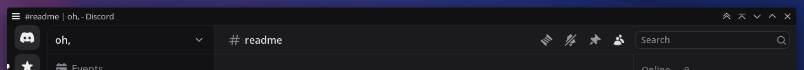
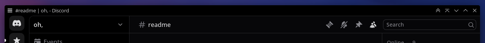
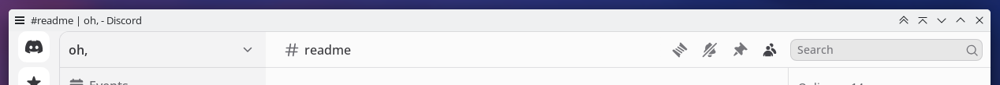
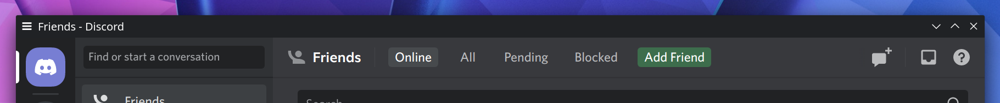
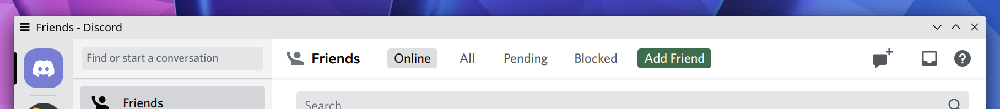

# Discord

The Linux version of Discord desktop uses the native titlebar, so no special settings are required to apply color schemes.

## Design refresh (March 2025)

While the application still uses the native titlebar, there is an additional "top bar" in the app now which you may want to hide via custom CSS using a client mod such as Vencord or OpenAsar. The screenshots below have such a customization applied.

## `Discord Ash.colors`

Also used for the "Light" theme with dark sidebar enabled.

## `Discord Dark New.colors`

## `Discord Onyx.colors`

## `Discord Light New.colors`

## Old design (pre-March 2025)

## `Discord Dark.colors`

Used for dark theme and for light theme with dark sidebar enabled.

## `Discord Light.colors`

Used for light theme without dark sidebar enabled.

