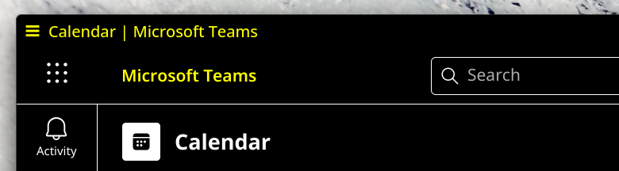

# Microsoft Teams

Teams on Linux is nowadays only available as a PWA you can install to your
system through various Chromium-based browsers, though typically PWAs installed
through the browser directly won't use the native titlebar, instead opting for
their own window chrome. To get around this you can use something like [Mint's
webapp manager](https://github.com/linuxmint/webapp-manager), which uses the
native titlebar, or you can opt to use something like [this community Electron
client for Teams](https://github.com/IsmaelMartinez/teams-for-linux). I prefer
to use the webapp manager since it also allows you to install extensions and
user styles in the dedicated Teams chromium profile.

- `Microsoft Teams Default.colors`
  
- `Microsoft Teams Dark.colors`
  
- `Microsoft Teams High Contrast.colors`
  
