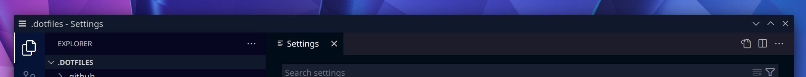
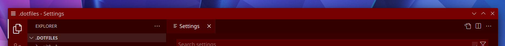

# VS Code

To use the native titlebar in VS Code, set the setting "Window: Title Bar Style" to "native" (`"window.titleBarStyle": "native"`).

## Light built-in themes

- `VS Code Default Light.colors` (For "Light+", "Light", and "VS2019 Light")
  
- `VS Code Quiet Light.colors`
  
- `VS Code Solarized Light.colors`
  

## Dark built-in themes

- `VS Code Default Dark.colors` (For "Dark+", "Dark", and "VS2019 Dark")
  
- `VS Code Abyss.colors`
  
- `VS Code Kimbie.colors`
  
- `VS Code Monokai.colors`
  
- `VS Code Monokai Dimmed.colors`
  
- `VS Code Red.colors`
  
- `VS Code Solarized Dark.colors`
  
- `VS Code Tomorrow Night Blue.colors`
  

## Marketplace themes

If a titlebar theme is missing for a VS Code community theme you use, please feel free to request or contribute it!

- `VS Code Erins Theme Dark.colors` (For [my personal theme](https://marketplace.visualstudio.com/items?itemName=eritbh.eritbh-theme)!)
  
